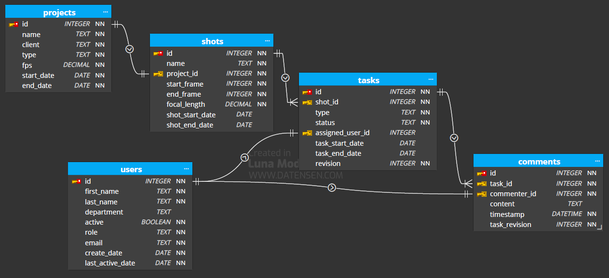

# VFX Project tracking system

By Wei-Hsiang Chen

Video overview: <https://youtu.be/QLY4O3hN0lg>

## Scope
*What is the purpose of your database?*
- Work progress tracking for film/series/commercial VFX project.

*Which people, places, things, etc. are you including in the scope of your database?*
- Artists, project coordinator, supervisors, projects, shots, different type of tasks and comments.

*Which people, places, things, etc. are *outside* the scope of your database?*
- Assets version tracking.
## Functional Requirements
*What should a user be able to do with your database?*
- Artists can see which task is assigned to them, which task is closest to the deadline, and read the supervisor's comment.

*What's beyond the scope of what a user should be able to do with your database?*
- It is possible that the project coordinator knows the artist's productivity and is aware of the project schedule behind way too far by analyzing the date.

## Representation

### Entities & Relationships

#### Entity Relationship Diagram

The ER diagram represents the following entities and relationships in the database:
- **users**: This table stores user's information such as `first_name`, `department` constraint to "VFX" and "COMP" by CHECK, `role` constraint to "Artist","Coordinator" and "Supervisor" by CHECK.
- **projects**: This table stores project information such as `type` constraint to "film" and "series" by CHECK. And the `fps` as `DECIMAL(2,1)` be able to store any value with two digits and one decimal.
- **shots**: This table stores shot information such as `start_frame`, `focal_length` as `DECIMAL(5,1)`,`shot_start_date` as `DATE`. And the `project_id` has `FOREIGN KEY` constraint applied, referencing the `id` column in the `projects` table. *One-to-one*
- **tasks**: This table stores task information such as `revision`, `status` as `TEXT`, `type` constraint to "pre", "prod", "post" by CHECK. And the `shot_id` has `FOREIGN KEY` constraint applied, referencing the `id` column in the `shots` table *One-to-many*, `assigned_user_id` referencing to the `users` table `id` column. *One-to-one*
- **comments**: This table stores comment information such as `timestamp` as `DATETIME`. And the `task_id` has `FOREIGN KEY` constraint applied, referencing the `id` column in the `tasks` table *One-to-many*, `commenter_id` referencing to the `comments` table `id` column *One-to-one*. Let's say the task has only one revision at the same time, and the supervisor will comment on the latest revision, so we have the `task_revision` to track that.

## Optimizations

*Which optimizations (e.g., indexes, views) did you create? Why?*
- Shot name index. Get shot info from entering the shot name will be queried on daily bias.
- The shot id view shows which shots are assigned to someone. Artists must want to know how many tasks they have and what they are. And this can also help artists to know what comment they got on what task.

## Limitations

*What are the limitations of your design?*
- The way to connect one-to-many relationship between entities is not very intuitive. i.e. task and shot or task and comment.

*What might your database not be able to represent very well?*
- It might be hard to get some useful statistics, such as "Which artist received the most comments last week?
